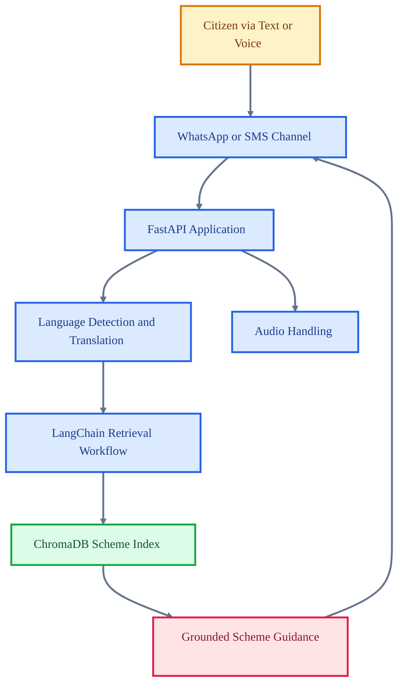

# Multilingual Welfare Scheme Assistant

<p align="center">

  
  
  
  
  
</p>

<p align="center">
  <strong>A low-bandwidth multilingual assistant that helps users discover government welfare schemes through conversational channels.</strong>
</p>

This project focuses on accessibility: users should be able to ask simple questions in familiar languages and receive grounded guidance about relevant welfare schemes. It combines retrieval, translation, speech handling, and messaging integration for practical public-service discovery.

## Core Capabilities

- Supports multilingual conversational access to welfare scheme information.
- Uses retrieval workflows to ground responses in indexed scheme data.
- Includes audio handling and translation support for low-bandwidth contexts.
- Integrates messaging workflows suitable for WhatsApp or SMS deployment.

## Technical Architecture

The FastAPI app is organized around chatbot logic, audio handling, database population, and API routing. Retrieval dependencies support a vector-backed knowledge base, while translation and messaging integrations widen access channels.

## Architecture Diagram



## Technology Stack

- FastAPI backend with LangChain orchestration.
- ChromaDB vector storage and sentence-transformer embeddings.
- Translation and language-detection libraries for multilingual support.
- Twilio integration for messaging workflows.
- Audio processing through pydub and multipart upload support.

## Repository Structure

- `app/main.py` - API entry point.
- `app/chatbot.py` - Conversation and retrieval workflow.
- `app/audio_handler.py` - Audio processing utilities.
- `populate_db.py` - Knowledge base population script.
- `requirements.txt` - Python dependencies.
- `USER_FLOW_DIAGRAM.md` - User journey documentation.

## Getting Started

```bash
python -m venv .venv
source .venv/bin/activate
pip install -r requirements.txt
```

```bash
uvicorn app.main:app --reload
```

## Professional Context

This project demonstrates applied NLP, retrieval, multilingual product design, and social-impact oriented backend engineering.
